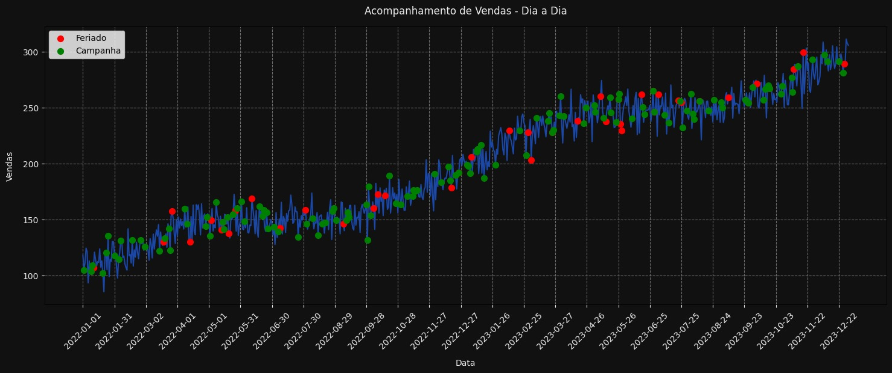
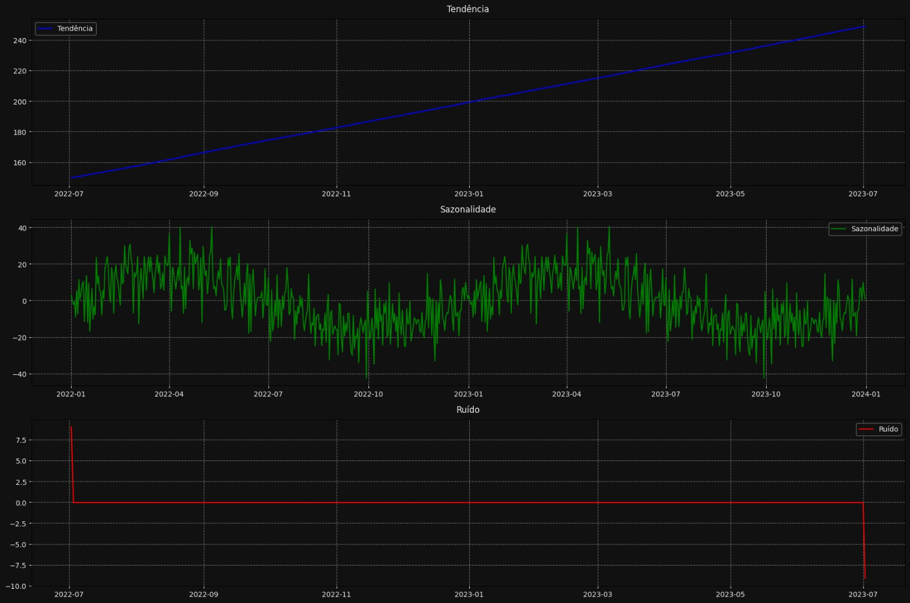

# Análise de Séries Temporais: Vendas, Feriados e Campanhas

Este projeto faz parte de uma série de desafios para a equipe de Data da Quero Educação, com o objetivo de desenvolver habilidades em análise de dados, engenharia de dados, ciência de dados e estatística. Nesse desafio foi realizada a decomposição de uma série temporal de dados de vendas, considerando a influência de campanhas de marketing e feriados. O objetivo é entender os padrões de comportamento nas vendas ao longo do tempo e identificar possíveis sazonalidades, tendências e ruídos, bem como o impacto de fatores externos.

## Organização da Análise:

1. **Carregamento e preparação dos dados**  
   - Leitura da base `dataset_desafio_series_temporais.csv`
   - Conversão da coluna de data para o formato `datetime`
   - Definição da data como índice da série

2. **Visualização da série original**
   - Gráfico de linha com customização de cores e formatação com `Seaborn` e `Matplotlib`
   - Destaque visual dos pontos de campanha e feriados

3. **Análise comparativa**
   - Cálculo da média de vendas em dias com e sem campanhas
   - Cálculo da média de vendas em dias com e sem feriados

4. **Decomposição da série temporal**
   - Separação da série de vendas em três componentes:
     - Tendência
     - Sazonalidade
     - Ruídos

5. **Visualização da decomposição**
   - Plots separados para cada componente da deomposição.

---

## Principais Conclusões

**Campanhas de Marketing**  
A diferença entre as vendas em dias de campanhas promocionais e dias comuns foi **extremamente pequena**, levando a supor que as campanhas atualmente em execução não estariam gerando resultados relevantes em termos de vendas.

**Feriados**  
Notou-se que as vendas em dias de feriado foram **acima da média** em relação às vendas em dias normais, sugerindo uma oportunidade para reforçar as ações nessas datas.

| Situação                  | Média de Vendas |
|--------------------------|-----------------:|
| Com campanha             | 198,10           |
| Sem campanha             | 199,64           |
| Com feriado              | 209,93           |
| Sem feriado              | 198,70           |

**Efeito Sazonal e Efeito Tendencial**  
A decomposição revelou:

Um **efeito tendencial** de crescimento.

Um **efeito sazonal** com alta no segundo trimestre do ano (meses de abril, maio e junho), e baixa nos meses de setembro até novembro.

---
